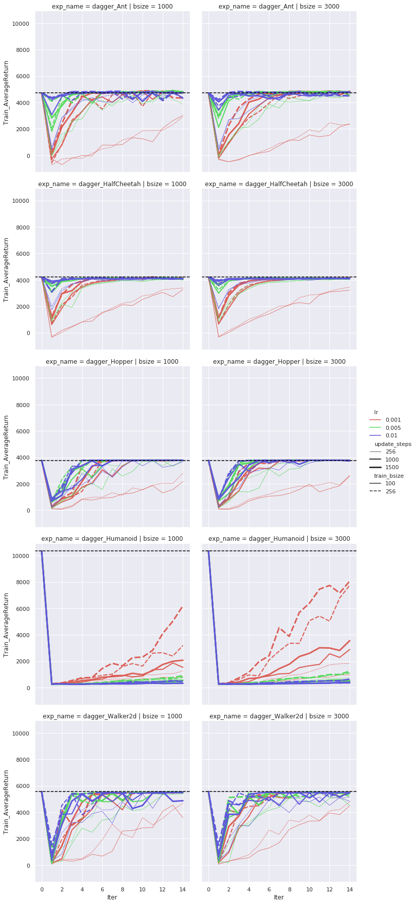
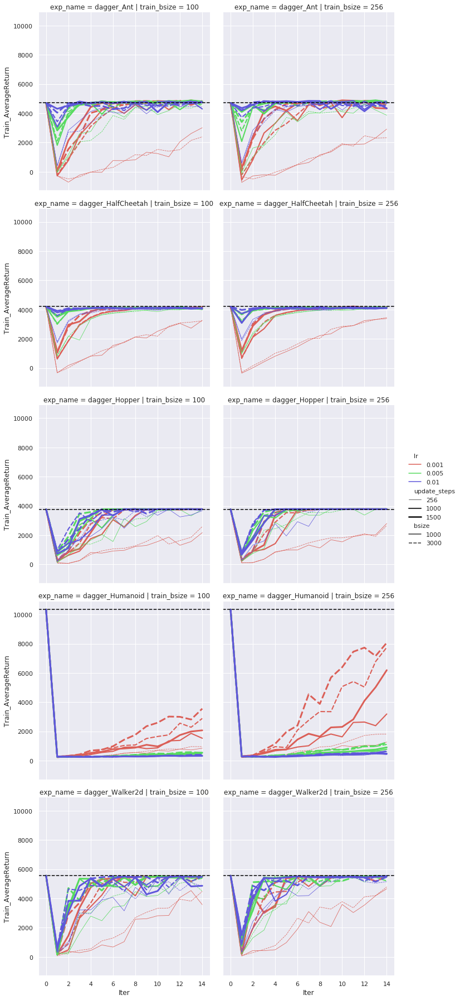
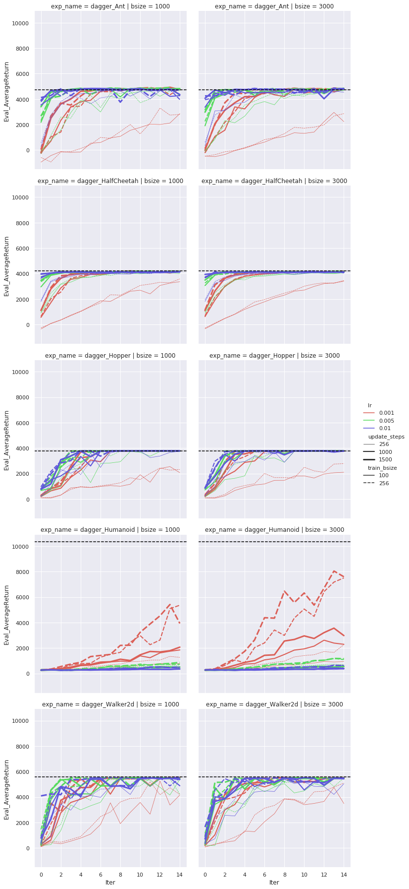
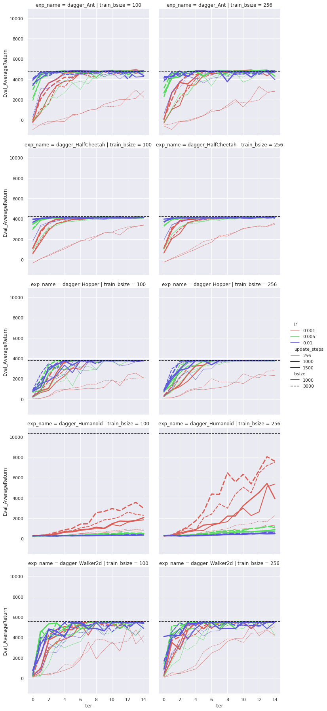

# cs285 hw1

[TOC]

## Config

> **exp_name_list** = [dagger_Humanoid, dagger_HalfCheetah, dagger_Hopper, dagger_Ant, dagger_Walker2d]
**num_agent_train_steps_per_iter_list** = [256, 1000, 1500]
**batch_size_list** = [1000, 3000]
**train_batch_size_list** = [100, 256]
**learning_rate_list** = [1e-3, 5e-3, 1e-2]

## Result

## Analysis

### Sensitive hyper-params

- **lr**: 不仅会影响收敛的速度, 也会影响最终收敛后的结果. 5个实验中, dagger_Humanoid中lr=1e-3明显好于5e-3和0.01, 其他4个都是5e-3和0.01明显好于1e-3. lr=1e-3时, 虽然相对来说小了一些,但是如果update_steps设置大一些的化最终收敛的结果会差不多.
- **update_steps**: 影响收敛的速度, 不影响最终结果, 更大更容易收敛.
- **batch_size**(collectin size in training): 1000与3000差别不大, 但是一般3000会稳定好于1000一点(在大部分实验中, 除了dagger_Humanoid, 在该实验中3000会明显好于1000).
- **train_batch_size**: 除了dagger_Humanoid(256明显好于100), 其他都无明显差别

#### Envs

最优参数配置:

- dagger_Humanoid
  - lr: 1e-3 >> 5e-3, 1e-2
  - update_steps: 1000~1500
  - batch_size: 3000 >> 1000
  - train_batch_size: 256 >> 100
  - dagger agent距离expert还有不小的差距
- dagger_HalfCheetah, dagger_Hopper, dagger_Ant, dagger_Walker2d
  - lr: 5e-3
  - update_steps: 1000
  - batch_size: 1000
  - train_batch_size: 100
  - dagger agent基本能达到expert的性能.

总的来说, bc agent都很差.
