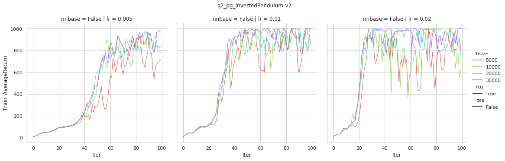

# cs285 hw1

[TOC]

## Result

```bash
python cs285/scripts/run_hw2.py --env_name CartPole-v0 -n 100 -b 1000 -dsa --exp_name q1_sb_no_rtg_dsa
python cs285/scripts/run_hw2.py --env_name CartPole-v0 -n 100 -b 1000 -rtg -dsa --exp_name q1_sb_rtg_dsa
python cs285/scripts/run_hw2.py --env_name CartPole-v0 -n 100 -b 1000 -rtg --exp_name q1_sb_rtg_na
python cs285/scripts/run_hw2.py --env_name CartPole-v0 -n 100 -b 5000 -dsa --exp_name q1_lb_no_rtg_dsa
python cs285/scripts/run_hw2.py --env_name CartPole-v0 -n 100 -b 5000 -rtg -dsa --exp_name q1_lb_rtg_dsa
python cs285/scripts/run_hw2.py --env_name CartPole-v0 -n 100 -b 5000 -rtg --exp_name q1_lb_rtg_na
```


```bash
python cs285/scripts/run_hw2.py --env_name InvertedPendulum-v2 --ep_len 1000 --discount 0.9 -n 100 -l 2 -s 64 -b (b*) -lr (r*) -rtg --exp_name q2_b(b*)_r(r*)
```



```bash
>python cs285/scripts/run_hw2.py --env_name LunarLanderContinuous-v2 --ep_len 1000 --discount 0.99 -n 100 -l 2 -s 64 -b 40000 -lr 0.005 --reward_to_go --nn_baseline --exp_name q3_b40000_r0.005
```


```bash
>python cs285/scripts/run_hw2.py --env_name HalfCheetah-v2 --ep_len 150 --discount 0.95 -n 100 -l 2 -s 32 -b (b) -lr (r) -rtg --nn_baseline --exp_name q4_search_b(b)_lr(r)_rtg_nnbaseline
```


```bash
>python cs285/scripts/run_hw2.py --env_name HalfCheetah-v2 --ep_len 150 --discount 0.95 -n 100 -l 2 -s 32 -b (b*) -lr (r*) --exp_name q4_b(b*)_r(r*)
python cs285/scripts/run_hw2.py --env_name HalfCheetah-v2 --ep_len 150 --discount 0.95 -n 100 -l 2 -s 32 -b (b*) -lr (r*) -rtg --exp_name q4_b(b*)_r(r*)_rtg
python cs285/scripts/run_hw2.py --env_name HalfCheetah-v2 --ep_len 150 --discount 0.95 -n 100 -l 2 -s 32 -b (b*) -lr (r*) --nn_baseline --exp_name q4_b(b*)_r(r*)_nnbaseline
python cs285/scripts/run_hw2.py --env_name HalfCheetah-v2 --ep_len 150 --discount 0.95 -n 100 -l 2 -s 32 -b (b*) -lr (r*) -rtg --nn_baseline --exp_name q4_b(b*)_r(r*)_rtg_nnbaseline
```


依次是
>spinup_halfH_tail_nnbaseV_viter_80.png
spinup_halfH_tail_nnbaseV_viter_1.png
spinup_halfH_tail_V0_viter_1.png

## Analysis

1. **reward_to_go:** 考虑了causality, 去除了无关的部分, 减小了variance.
**batch_size:** reduce variance. vpg中batch_size一般都很大(>1k), 很多都是>10k, 小的batch_size很不稳定.

2. **advantage normalization:** normalization advantage function to reduce variance.
   - **minus baseline:** reduce variance
   - **divide std:** 迭代更新policy的过程中, 绝对准确的state-value并没有必要, 只需要给出一定的信息来选择正确的动作, 然后迭代更新policy即可. 所以returns减去baseline并不妨碍选出较优的动作, 同时returns的absolute值也只需保持相对的大小即可, 即可以devide std. 如果在环境中R的分布在变化可以利用这种方法来优化迭代(lr变的更好选了, 不需要在不同的R分布上用不同的lr).

3. **train_v_iters:** PG中policy model依赖于value model, 所以value model一般会比policy model多训练一些iterations, 这样在有了一些较为靠谱的value model之后进行policy model的学习会加速训练.

4. **episode cut:** Env非正常的结束(即被人为的cut), 这时候如果直接当成正常的结束来处理, 即$V(S_T)=0$会降低学习的效果. 最好的方式是用value model来估计$V(S_T)$.

## Code

### spinup

1. vpg中data_buffer的大小是跟每个epoch收集的数据大小是一致的, 即每个epoch都只用本epoch收集的数据. on-policy
2. train_v_iters 默认设为80

### cs285

1. tail cut-off: $V(S_T)=0$
2. train_v_iters =1

### Thinking

1. PG主要学的是$\pi_{\theta}$. 给定$\pi_{\theta}$, 通过sampling得到一堆轨迹$\{\tau\}$, 这堆数据中蕴含了问题的局部结构等信息, 然后尝试调整$\theta$, 以改变$\tau$的分布来使得已采样的轨迹中期望回报最大.
2. PG可以用来寻找函数的最大值. 即$\pi_\theta$产生自变量的空间分布, 函数值是对应的reward. 该环境进行一步即结束. 整个过程类似于CMA-ES.
3. 两个相邻时刻的$\pi_\theta$的梯度大概率关联性较高, 如果纯粹的SGD则没有考虑这一层的信息, 用ADAM则可以利用这一信息, 同时ADAM自适应的步长可以稳定训练.
4. GAE-$\lambda$中如果$\lambda\rightarrow 1$, 则GAE-$\lambda\rightarrow MC=TD(1)$. 如果$lambda\rightarrow 0$, 则GAE-$\lambda\rightarrow TD(0)$, 一般取0.97.
5. GAE-$\lambda$可以加速模型的训练, 尤其在reward较为sparse的时候. 因为这个时候TD(0)即一步的TD-learning, 错误只能传播一步, 而GAE-$\lambda$则可以传播多步.  
6. PG不需要epsilon-greedy, 因为$\pi_\theta$本身通过梯度上升在不断地向最优的policy靠近, 同时policy model在输出时自带概率分布(Category dist/Gaussian dist).
