# cs285 hw1

[TOC]

## Code

### Atari

1. DeepMind-style Atari env:

    ```python
    def wrap_deepmind(env):
        """Make end-of-life == end-of-episode, but only reset on true game over. Done by DeepMind for the DQN and co. 
        since it helps value estimation. 没有命了立马重启."""
        env = EpisodicLifeEnv(env)
        """Sample initial states by taking random number of no-ops on reset. No-op is assumed to be action 0."""
        env = NoopResetEnv(env, noop_max=30)
        """Return only every `skip`-th frame"""
        env = MaxAndSkipEnv(env, skip=4)
        """Take action on reset for environments that are fixed until firing."""
        if 'FIRE' in env.unwrapped.get_action_meanings():
            env = FireResetEnv(env)
        """把原始图片处理成84*84*1的大小"""
        env = ProcessFrame84(env)
        """Bin reward to {+1, 0, -1} by its sign."""
        env = ClipRewardEnv(env)
        return env
    ```

2. config

    ```python
    {
        'learning_starts': 50000,
        'target_update_freq': 10000,
        'replay_buffer_size': int(1e6),
        'num_timesteps': int(2e8),
        'learning_freq': 4,  # train freq, 和'frame_history_len'一致
        'grad_norm_clipping': 10,
        'frame_history_len': 4, # 合并相邻4 frames to represent state (84, 84, 4)
    }
    ```

atari optimizer config:
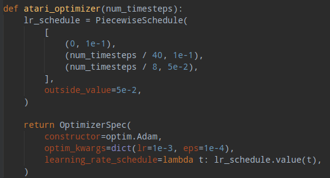
atari explore config:
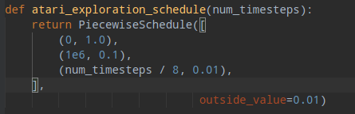

### DQN code

1. replay_buffer
每个时刻存取(obs, act, rew, next_obs, done), 有最大容量, 循环存取. frame存的是uint8,节省内存.
2. critic loss

    ```python
    loss = nn.SmoothL1Loss() 
    ```

### Pytorch

1. optimizer中定的是base_lr, learning_rate_scheduler中的学习率是调整的比率, 它和base_lr相乘得到最终的lr.
2. LambdaLR, 传入lambda函数来调整lr
   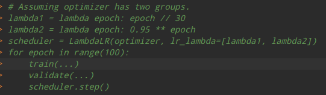
3. 增加接口的通用性, 可以传入一些函数类型的参数(lambda函数, 或者回调函数)
4. 把一些常用的函数, 常量统一放入到一个module文件中, 然后用这个module来访问这些函数, 常量. 如pytorch_utils.py中:
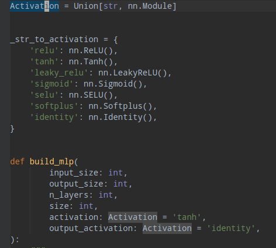
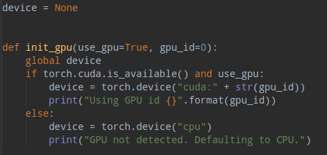
这些方法和变量在不同的项目中都能用到, 而且不用改变.
5. 运行时才sampling

    ```python
        idxes = sample_n_unique(lambda: random.randint(0, 10), batch_size)
    ```

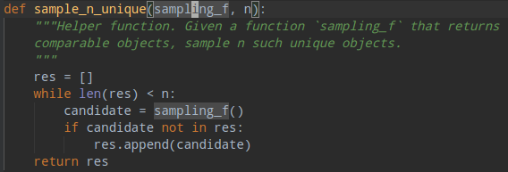

### RL framework design

<!-- 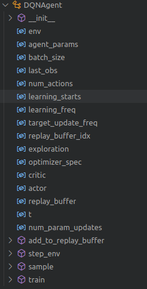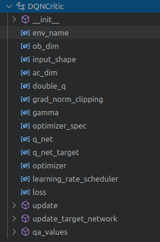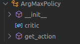
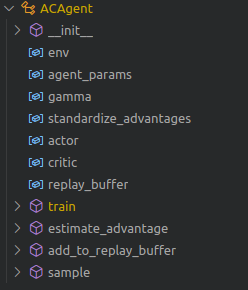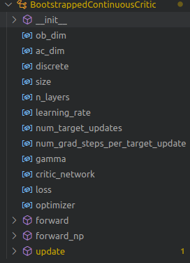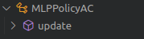
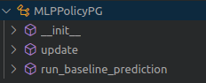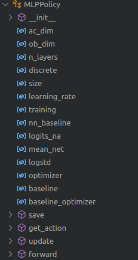 -->
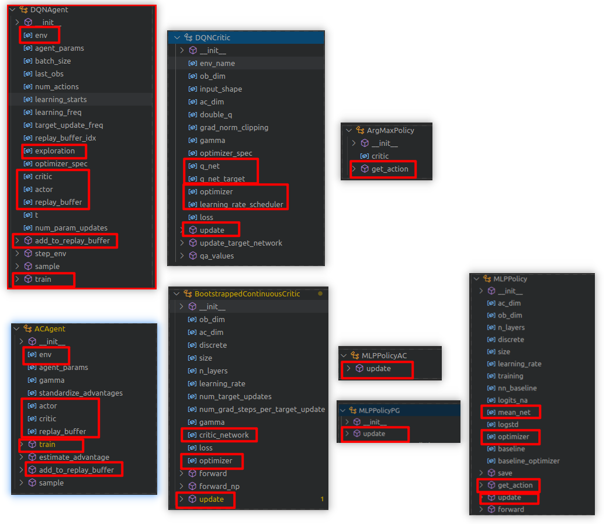

## Exps

### DQN

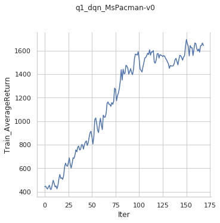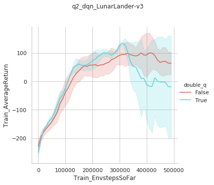

### AC

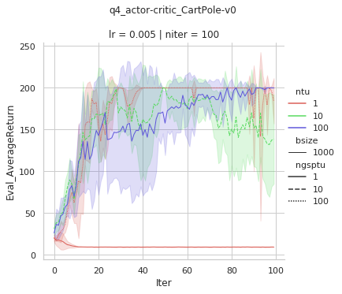
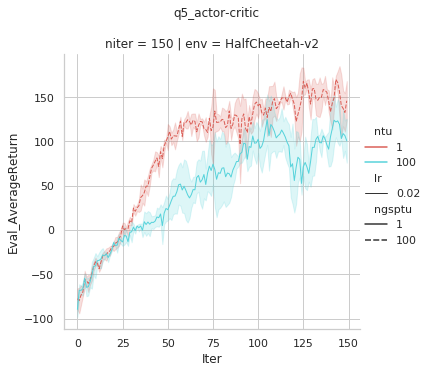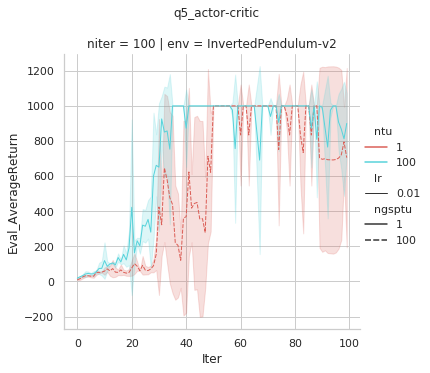
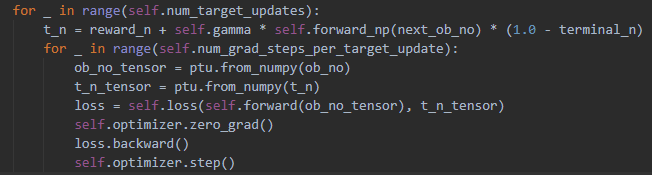
> **ntu**: num_target_updates
**ngsptu**: num_grad_steps_per_target_update

可以看出

1. ntu ~ ngsptu, 模型训练效果很差.
2. ntu >> ngsptu, 模型需要花更多时间收敛, 最终效果和 ngsptu >> ntu 相当
3. ngsptu >> ntu, 模型收敛快,但是收敛后容易震荡(因为保持target不变的情况下, 进行了更多次的梯度下降)

### Comparison: **DQN** vs **AC**

**DQN**
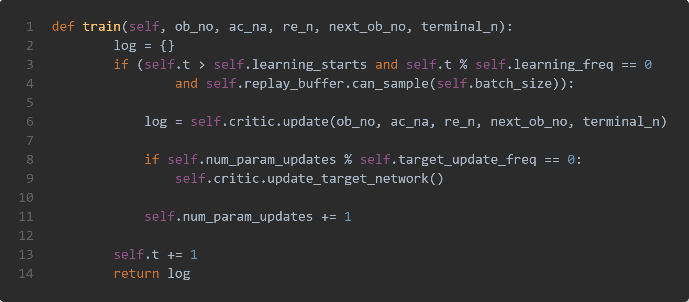
**AC**
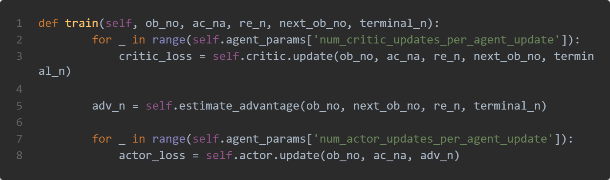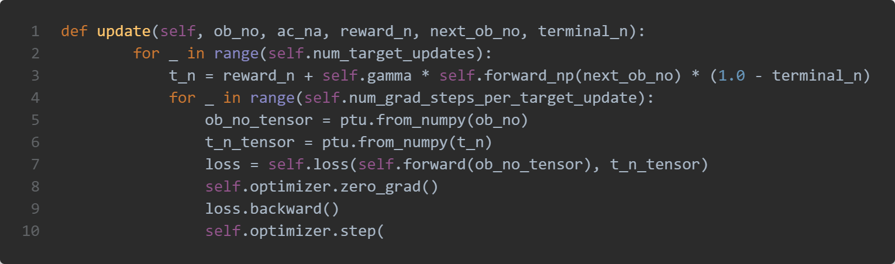
DQN has a target network, but AC doesn't has. The reason is DQN每次迭代的batch_size比较小(~32), 更新是高频的, actor模型更新较快, 很难先计算出来很多数据的target value, 然后fix. AC由于每次update是用rollouts的数据, 数据较多. 所以可以fix actor的模型当成target model, 然后去计算target value, 然后执行多次更新.
